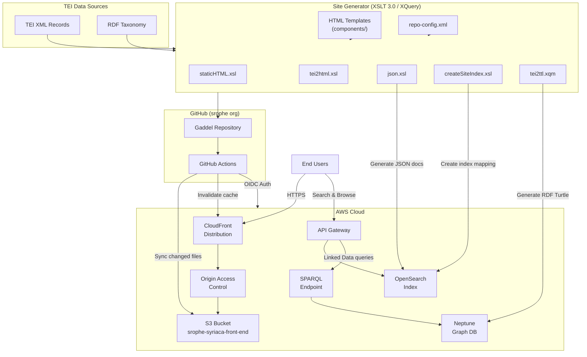
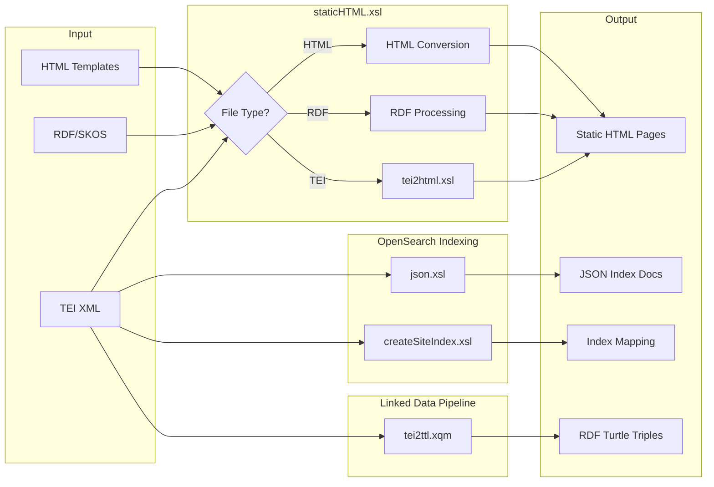
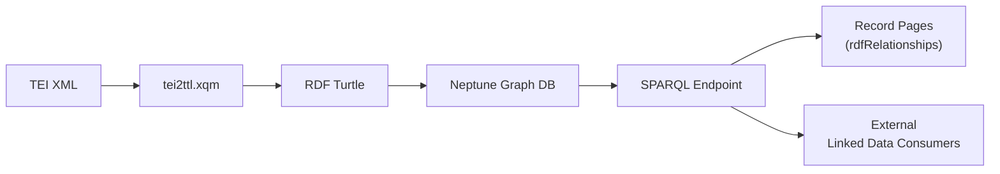

# Gaddel

A static site generator and publishing platform for TEI (Text Encoding Initiative) XML data, built for [Syriaca.org: The Syriac Reference Portal](http://syriaca.org).

Gaddel transforms TEI XML scholarly data into static HTML pages, indexes them into OpenSearch for search and browse, generates RDF triples for a Neptune graph database, and deploys to AWS via GitHub Actions — replacing the previous eXist-db dynamic application with a serverless architecture.

## Architecture



## Project Structure

```
Gaddel/
├── .github/workflows/     # CI/CD pipeline (deploy to S3)
├── siteGenerator/         # XSLT-based static site generator
│   ├── components/        # HTML page templates per collection
│   └── xsl/               # XSLT/XQuery for TEI→HTML, OpenSearch, and RDF
├── resources/             # Frontend assets
│   ├── bootstrap/         # Bootstrap 3 CSS/JS
│   ├── css/               # Custom stylesheets
│   ├── fonts/             # Syriac and other fonts
│   ├── images/            # Logos, icons, sponsor images
│   ├── js/                # jQuery, search.js (OpenSearch client), maps
│   ├── keyboard/          # Virtual keyboards (Syriac, Arabic, Hebrew, etc.)
│   └── leaflet/           # Leaflet.js map library
├── data/taxonomy/         # RDF taxonomy data
│
│── # Collection modules (each with browse, search, record pages):
├── geo/                   # The Syriac Gazetteer (places)
├── persons/               # Syriac Biographical Dictionary (SBD)
├── authors/               # A Guide to Syriac Authors
├── q/                     # Qadishe: Guide to Syriac Saints
├── bhse/                  # Bibliotheca Hagiographica Syriaca Electronica
├── nhsl/                  # New Handbook of Syriac Literature
├── cbss/                  # Comprehensive Bibliography on Syriac Studies
├── saints/                # Gateway to the Syriac Saints
├── taxonomy/              # Taxonomy of Syriac Studies
├── johnofephesus/         # John of Ephesus project
├── lives/                 # Lives of saints
│
├── documentation/         # Schemas, TEI ODD, editorial docs
├── api-documentation/     # API reference
├── index.html             # Homepage
├── search.html            # Global advanced search
├── browse.html            # Global browse
└── LICENSE                # GPL-3.0
```

## Collections

| Collection | Path | Description |
|---|---|---|
| Gazetteer | `/geo/` | Historical geography of places related to Syriac studies |
| SBD | `/persons/` | Syriac Biographical Dictionary |
| Authors | `/authors/` | Guide to Syriac Authors |
| Qadishe | `/q/` | Catalogue of saints in the Syriac tradition |
| BHSE | `/bhse/` | Bibliotheca Hagiographica Syriaca Electronica |
| NHSL | `/nhsl/` | New Handbook of Syriac Literature |
| CBSS | `/cbss/` | Comprehensive Bibliography on Syriac Studies (27,000+ publications) |
| Saints | `/saints/` | Gateway to the Syriac Saints |
| Taxonomy | `/taxonomy/` | Taxonomy of Syriac Studies (RDF/SKOS) |
| John of Ephesus | `/johnofephesus/` | Prosopography and gazetteer for John of Ephesus |

## Site Generator

The core of Gaddel is an XSLT 3.0 / XQuery pipeline in `siteGenerator/` that transforms TEI XML and RDF data into static HTML, OpenSearch index documents, and RDF triples:



Key stylesheets and modules:
- `staticHTML.xsl` — Main entry point; routes input to appropriate transformation
- `tei2html.xsl` — Converts TEI elements to HTML
- `json.xsl` — Generates OpenSearch JSON index documents from TEI records
- `createSiteIndex.xsl` — Generates OpenSearch index mapping from repo-config search fields
- `tei2ttl.xqm` — XQuery module that converts TEI records to RDF Turtle triples for Neptune
- `maps.xsl` — Generates Leaflet map markup from `tei:geo` coordinates
- `bibliography.xsl` / `citation.xsl` — Bibliographic formatting
- `relationships.xsl` — Renders TEI relationship data
- `geoJSON.xsl` — Generates GeoJSON from place data
- `helper-functions.xsl` — Shared utility functions

Configuration is driven by `siteGenerator/components/repo-config.xml`, which defines collections, search fields, keyboard options, and URI patterns.

## Search & OpenSearch

Search and browse functionality is powered by an OpenSearch index accessed via API Gateway:


The search client (`resources/js/search.js`) supports:
- Full-text keyword search across all collections
- Alphabetical browse with multilingual support (English, Syriac, Arabic, Hebrew, Greek, Russian, Armenian)
- Advanced search with field-specific filters (author, title, dates, place names, person names, etc.)
- CBSS subject-based browsing with related subject discovery and infinite scroll
- Historical era browsing for CBSS (century-based and era-grouped queries)
- Pagination and URL state management for shareable search results

The OpenSearch index is populated by running `json.xsl` over TEI records, which extracts fields defined in `repo-config.xml` (titles, authors, dates, coordinates, abstracts, etc.) into JSON documents. The index mapping is generated by `createSiteIndex.xsl`.

## Linked Data & Neptune

Gaddel publishes linked open data as RDF triples stored in an Amazon Neptune graph database, queryable via a SPARQL endpoint:



The `tei2ttl.xqm` XQuery module converts TEI records into RDF Turtle triples using standard ontologies:
- `lawd:` (Linked Ancient World Data) — for persons, places, and conceptual works
- `foaf:` — for person relationships and topic references
- `dcterms:` — for bibliographic resources and relations
- `schema:` — for descriptions and abstracts
- `skos:` — for taxonomy concepts
- `geosparql:` — for geographic coordinates

Triples generated include:
- Entity types (persons, places, works, bibliographic resources)
- Name variants in multiple languages (English, Syriac, Arabic, French)
- Biographical data (birth/death dates and places, floruit, gender, occupation, status)
- Geographic data (GPS coordinates, existence dates, religious communities)
- Relationships between entities (active/passive/mutual relations from TEI)
- Citations and cross-references between records
- Links to external authority files (close matches to non-Syriaca URIs)

Record pages dynamically load relationship data from the SPARQL endpoint via the `rdfRelationships` component, displaying linked entities in the sidebar.

## Deployment

Deployment is automated via GitHub Actions (`.github/workflows/main.yml`):

1. On push to `main`, the workflow triggers
2. Authenticates to AWS via OIDC (no stored credentials)
3. Detects changed files using `git diff`
4. Uploads only changed files to S3 bucket
5. Falls back to full `aws s3 sync` if a file was deleted
6. Invalidates the CloudFront cache

Data directories (`json-data/`, `person/`, `place/`, `work/`, `cbss/`, etc.) are excluded from sync as they are managed separately.

## Frontend Stack

- Bootstrap 3 for layout and responsive design
- jQuery + jQuery UI for interactivity
- Leaflet.js for interactive maps
- Virtual keyboard support for Syriac (phonetic & standard), Arabic, Hebrew, Greek, and Russian
- Switchable Syriac fonts: Estrangelo Edessa, East Syriac Adiabene, Serto Batnan
- Plausible Analytics for privacy-friendly usage tracking

## Security & Reliability

### Authentication & Access Control
- **GitHub OIDC** — Deployments authenticate via OpenID Connect, eliminating stored AWS credentials. Short-lived tokens are scoped to specific repos and branches
- **Origin Access Control (OAC)** — S3 bucket is fully private; only CloudFront can read objects via SigV4-signed requests
- **S3 Public Access Block** — All four public access block settings enabled (BlockPublicAcls, BlockPublicPolicy, IgnorePublicAcls, RestrictPublicBuckets)
- **Least-privilege IAM** — Deploy role is limited to s3:PutObject, s3:DeleteObject, s3:ListBucket, and cloudfront:CreateInvalidation
- **Secrets management** — AWS account IDs, role ARNs, and distribution IDs stored as GitHub encrypted secrets, never in code

### Content Delivery & Availability
- **CloudFront CDN** — Global edge caching for low-latency content delivery with automatic failover across edge locations
- **AWS WAF** — Web Application Firewall attached to CloudFront and API Gateway for rate limiting, bot mitigation, and protection against common web exploits (SQL injection, XSS)
- **HTTPS enforced** — ViewerProtocolPolicy set to redirect-to-https; all traffic encrypted in transit
- **API Gateway throttling** — Request rate limits and burst controls on the search/SPARQL API to prevent abuse and protect backend services
- **API Gateway resource policies** — Restrict API access by origin, IP range, or referrer to prevent unauthorized consumption of OpenSearch and Neptune resources
- **CORS configuration** — API Gateway configured with strict Cross-Origin Resource Sharing headers, limiting API access to trusted domains
- **Cache invalidation** — Automated on every deployment to ensure users always receive current content
- **Static site architecture** — No server-side runtime to fail; S3 provides 99.999999999% (11 nines) durability and 99.99% availability
- **S3 versioning** — Object versioning enables rollback to any previous deployment state in case of accidental overwrites or deletions
- **S3 cross-region replication** — Data replicated to a secondary region for disaster recovery and business continuity
- **S3 lifecycle policies** — Automated transition of old object versions to cost-effective storage tiers; expired versions cleaned up automatically

### Deployment Safety
- **Incremental deploys** — Only changed files are uploaded (via git diff), minimizing blast radius and deployment time
- **Sync fallback** — If a file deletion is detected, falls back to full aws s3 sync with exact-timestamps for consistency
- **Data isolation** — Data directories (person/, place/, work/, cbss/, etc.) are excluded from sync to prevent accidental overwrites from the code repo
- **Branch protection** — Deployments only trigger on push to main
- **Full git history** — Checkout uses fetch-depth: 0 for accurate diff comparisons

### Data Integrity
- **TEI XML validation** — Source data conforms to TEI P5 with project-specific ODD constraints (syriaca-tei-main.odd)
- **Stable URIs** — All entities have persistent identifiers (http://syriaca.org/{type}/{id}) ensuring long-term citability
- **Creative Commons licensing** — CC BY 4.0 on all content with clear attribution requirements
- **Git version control** — Full history of all data and code changes across both code and data repositories

## License

GPL-3.0 — See [LICENSE](LICENSE) for details.

Content is licensed under [Creative Commons Attribution 4.0 International (CC BY 4.0)](https://creativecommons.org/licenses/by/4.0/).

## Citation

**Notes:** David A. Michelson, general editor; Daniel L. Schwartz, director; Jeanne-Nicole Mellon Saint-Laurent, associate director; Nathan Gibson, William L. Potter, and James E. Walters, editors; Erin Geier and Winona Salesky, senior programmers, *Syriaca.org: The Syriac Reference Portal* (2014–), [http://syriaca.org](http://syriaca.org)
